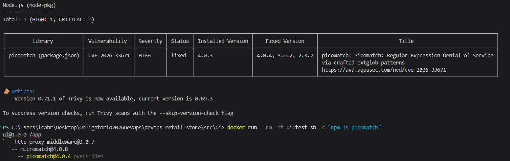
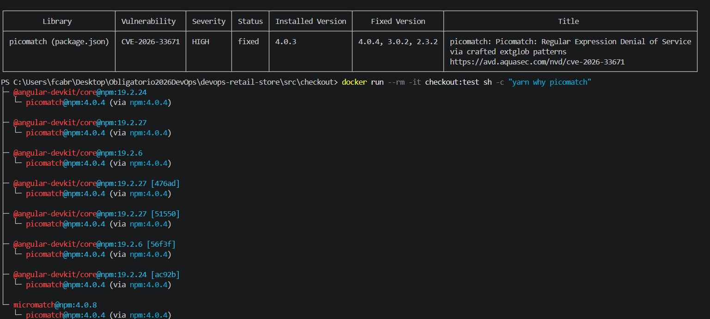
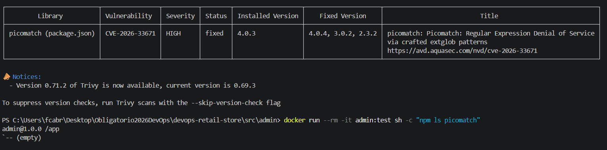
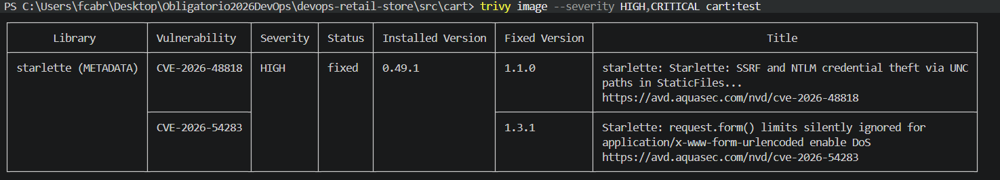
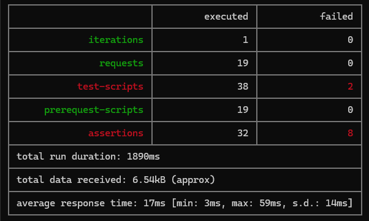
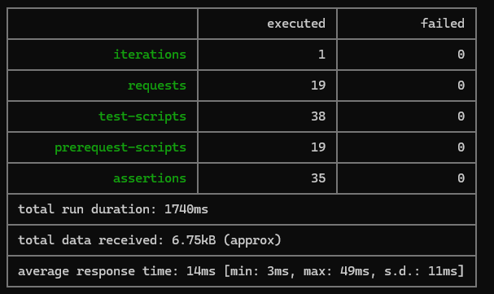

# DevSecOps

Este documento describe la estrategia DevSecOps aplicada en el proyecto, las herramientas seleccionadas, los motivos de su elección y la forma en que fueron integradas dentro del pipeline CI/CD para fortalecer la seguridad del ciclo de desarrollo.

## ¿Qué hace DevSecOps?

Antes de empezar a explicar que hacemos y como, debemos de entender el porqué hacemos esto, y que hace a DevSecOps, DevSecOps.

### Definición

Marco que integra desarrollo, seguridad y operaciones en todo el ciclo de vida del software para reducir vulnerabilidades y riesgos de seguridad.

### Componentes clave

- Integración continua:
  - Los desarrolladores integran código frecuentemente en un repositorio central, donde se compila y prueba automáticamente para detectar errores e incompatibilidades de forma temprana.

- Entrega continua:
  - Automatiza el paso del código desde compilación hasta un entorno de pruebas, ejecutando validaciones funcionales, de integración, APIs y rendimiento para entregar software listo para producción.

- Seguridad DevSecOps:
  - Integra la seguridad en todo el ciclo de vida del desarrollo mediante modelado de amenazas y pruebas de seguridad automatizadas para detectar vulnerabilidades cuanto antes.

## Herramientas

### SAST (Static Application Security Testing)

SAST es una técnica de seguridad que analiza el código fuente, bytecode o binarios sin ejecutar la aplicación. Su objetivo es detectar vulnerabilidades, errores de programación y malas prácticas de seguridad en etapas tempranas del desarrollo.

#### Semgrep

Semgrep es una herramienta de SAST de código abierto que analiza el código mediante reglas predefinidas o personalizadas para identificar vulnerabilidades y problemas de calidad.

#### ¿Por qué se eligió Semgrep?

Los motivos principales de elegir Semgrep como nuestra herramienta SAST son:

- Soporta múltiples lenguajes utilizados en el proyecto:
  - Python
  - TypeScript
  - HTML
  - Dockerfile
  - Go
  - HCL

- Se integra fácilmente en pipelines de GitHub Actions.
- Detecta vulnerabilidades comunes como:
  - Inyecciones de código.
  - Uso inseguro de APIs.
  - Exposición de secretos.
  - Errores de configuración.

- Genera reportes en formatos estándar como SARIF para integrarse con herramientas de análisis de seguridad.

### SCA (Software Composition Analysis)

SCA es una técnica que permite analizar las dependencias y bibliotecas de terceros utilizadas por una aplicación para identificar vulnerabilidades conocidas (CVEs), componentes obsoletos y riesgos de licenciamiento.

#### Trivy

Trivy es una herramienta de seguridad de código abierto que permite analizar dependencias, sistemas de archivos, imágenes de contenedor y configuraciones en busca de vulnerabilidades conocidas.

#### ¿Por qué se eligió Trivy?

Los motivos principales de elegir Trivy como herramienta de SCA son:

- Soporta múltiples ecosistemas de dependencias:
  - npm
  - pip
  - Go Modules
  - Maven
  - NuGet

- Posee una base de datos actualizada de vulnerabilidades conocidas.
- Es rápida y sencilla de integrar en GitHub Actions.
- Permite analizar múltiples microservicios desde una misma ejecución.
- Genera reportes en formatos JSON, SARIF y tablas legibles para auditoría.

### Quality Gate

Un Quality Gate es un conjunto de reglas que determina si una aplicación cumple los requisitos mínimos de seguridad antes de avanzar a la siguiente etapa del pipeline.

#### Trivy

Trivy bloquea vulnerabilidades HIGH/CRITICAL detectadas por el scan, exceptuando hallazgos sin fix aplicable o CVE explícitamente justificados en `.trivyignore`.

#### Criterio definido

El pipeline falla automáticamente cuando se detectan vulnerabilidades de severidad HIGH o CRITICAL.

Este criterio asegura que únicamente se desplieguen artefactos que cumplan con los estándares mínimos de seguridad definidos para el proyecto.

### Escaneo de Imágenes

El escaneo de imágenes permite identificar vulnerabilidades presentes en el sistema operativo base, librerías instaladas y paquetes incluidos dentro de los contenedores.

#### Trivy

Trivy analiza cada imagen Docker generada durante el proceso de integración continua antes de ser publicada en el registro de contenedores.

#### ¿Por qué se eligió Trivy?

- Detecta vulnerabilidades en imágenes base como Alpine, Debian o Ubuntu.
- Identifica paquetes vulnerables instalados dentro del contenedor.
- Permite bloquear la publicación de imágenes con riesgos críticos.
- Facilita la corrección temprana mediante la actualización de imágenes base o dependencias.

### Secret Detection

La detección de secretos busca prevenir la exposición accidental de credenciales, claves de acceso, tokens y cadenas de conexión dentro del repositorio.

#### Gitleaks

Gitleaks es una herramienta de código abierto especializada en detectar secretos expuestos mediante reglas predefinidas y personalizables.

#### ¿Por qué se eligió Gitleaks?

Los motivos principales de elegir Gitleaks son:

- Detecta una amplia variedad de credenciales:
  - API Keys
  - Access Tokens
  - Passwords
  - Connection Strings
  - Claves de proveedores cloud

- Se integra fácilmente en GitHub Actions.
- Permite escanear tanto el código actual como el historial de Git.
- Falla automáticamente el pipeline cuando se detectan secretos expuestos.

#### Política aplicada

Ninguna contraseña, token, API Key o cadena de conexión debe almacenarse directamente en el código fuente o archivos de configuración del repositorio.

Toda información sensible debe gestionarse mediante:

- GitHub Secrets.
- Variables de entorno.

## Documentación de hallazgos

Como pedido en el punto 5.5 de la letra del obligatorio, se reportarán todos los hallazgos, y las medidas tomadas.

| Herramienta | Hallazgo Encontrado        | Ubicación  | Remediación                                                                                                                                                                                                                                                                     |
| ----------- | -------------------------- | ---------- | ------------------------------------------------------------------------------------------------------------------------------------------------------------------------------------------------------------------------------------------------------------------------------- |
| Trivy       | `path-to-regexp`           | `checkout` | Aunque `@nestjs/platform-express` utiliza la versión `"8.4.2"`, la última versión disponible de `express` continúa dependiendo de `router`, que incorpora `path-to-regexp 8.2.0`, por lo que no fue posible actualizarla directamente sin esperar una corrección del proveedor. |
| Trivy       | `glob`                     | `checkout` | Se actualizó `@nestjs/cli` y fue necesario actualizar también `rimraf` para incorporar una versión corregida de `glob`.                                                                                                                                                         |
| Trivy       | `minimatch`                | `checkout` | Se actualizó `@nestjs/cli`, sin embargo, fue necesario forzar una versión más reciente debido a que `fork-ts-checker-webpack-plugin` dependía de una versión vulnerable de `minimatch`.                                                                                         |
| Trivy       | `picomatch`                | `admin`    | La versión de `picomatch` tuvo que ser forzada a la `"4.0.4"`.                                                                                                                                                                                                                  |
| Trivy       | `go.opentelemetry.io/otel` | `catalog`  | Se actualizó la versión de `go.opentelemetry.io/otel` y de Go ya que el primero depende de una versión mayor de Go.                                                                                                                                                             |
| Trivy       | `google.golang.org/grpc`   | `catalog`  | Se actualizó la versión de `google.golang.org/grpc`, ya que `go.opentelemetry.io/otel` trae una versión con vulnerabilidad.                                                                                                                                                     |
| Trivy       | `github.com/jackc/pgx/v5`  | `orders`   | Se actualizó la versión de `github.com/jackc/pgx/v5`                                                                                                                                                                                                                            |
| Trivy       | `multer`                   | `checkout` | Se forzó la versión `2.2.0` de `multer`.                                                                                                                                                                                                                                        |
| Trivy       | `picomatch`                | `ui`       | Se forzó la versión `4.0.4` de `picomatch` porque, `http-proxy-middleware` no trae la necesaria para evitar vulnerabilidades                                                                                                                                                    |
| Trivy       | `picomatch`                | `checkout` | Se forzó la versión `4.0.4` de `picomatch`.                                                                                                                                                                                                                                     |
| Trivy       | `tmp`                      | `checkout` | Se forzó la versión `0.2.7`.                                                                                                                                                                                                                                                    |
| Trivy       | `lodash`                   | `checkout` | Se forzó la versión `4.18.0`.                                                                                                                                                                                                                                                   |
| Trivy       | `starlette`                | `cart`     | Se forzó la versión `0.49.1`.                                                                                                                                                                                                                                                   |
| Trivy       | `golang.org/x/net`         | `catalog`  | Se forzó la versión `0.55.0`.                                                                                                                                                                                                                                                   |
| Trivy       | `golang.org/x/net`         | `orders`   | Se forzó la versión `0.55.0`.                                                                                                                                                                                                                                                   |
| Trivy       | `golang.org/x/crypto`      | `catalog`  | Se forzó la versión `0.52.0`.                                                                                                                                                                                                                                                   |
| Trivy       | `golang.org/x/crypto`      | `orders`   | Se forzó la versión `0.52.0`.                                                                                                                                                                                                                                                   |

## Excepciones

### Componente: UI

Pese a haber forzado a `picomatch` a su versión `4.0.4`, Trivy detecta que existe una versión anterior, `4.0.3`.

Por lo que se optó, después de confirmar que el container tiene dentro la versión correcta, ignorar este error, y tenerlo como un fallo de Trivy a la hora de detectar vulnerabilidades.



- Se creó el container con `docker build -t ui:test .` desde `..\src\ui`.
- Se realizó el scan de `trivy image --severity HIGH,CRITICAL ui:test`.
- Se corrió el comando `docker run --rm -it ui:test sh -c "npm ls picomatch"`, que ejecuta el `npm ls picomatch` dentro del container, devolviendo que la versión utilizada es la correcta.

### Componente: Checkout

Pese a haber forzado a `picomatch` a su versión `4.0.4`, Trivy detecta que existe una versión anterior, `4.0.3`.

Por lo que se optó, después de confirmar que el container tiene dentro la versión correcta, ignorar este error, y tenerlo como un fallo de Trivy a la hora de detectar vulnerabilidades.



- Se creó el container con `docker build -t ui:test .` desde `..\src\checkout`.
- Se realizó el scan de `trivy image --severity HIGH,CRITICAL checkout:test`.
- Se corrió el comando `docker run --rm -it checkout:test sh -c "yarn why picomatch"`, que ejecuta el `yarn why picomatch`, equivalente a `npm ls picomatch` en yarn, dentro del container, devolviendo que la versión utilizada es la correcta.

### Componente: Admin

Pese a haber forzado a `picomatch` a su versión `4.0.4`, Trivy detecta que existe una versión anterior, `4.0.3`.

Después de confirmar que, `picomatch` no existe dentro del container luego de hacer el build; o sea, que se trata de una dependencia de `dev`; se optó por ignorar este error, y tenerlo como un fallo de Trivy a la hora de detectar vulnerabilidades.



- Se creó el container con `docker build -t admin:test .` desde `..\src\admin`.
- Se realizó el scan de `trivy image --severity HIGH,CRITICAL admin:test`.
- Se corrió el comando `docker run --rm -it admin:test sh -c "npm ls picomatch"`, que ejecuta el `npm ls picomatch` dentro del container, devolviendo que picomatch no existe en producción.

### Componente: Cart

Inicialmente, se actualizó `starlette` a la versión `0.49.1`, lo que permitió resolver una de las vulnerabilidades detectadas. Sin embargo, permanecían los hallazgos `CVE-2026-48818` y `CVE-2026-54283`, cuya corrección requería actualizar la dependencia a la versión `1.3.1`.



Al utilizar conjuntamente las versiones más recientes de fastapi, starlette y prometheus-fastapi-instrumentator, el servicio comenzó a devolver errores HTTP 500 en todos los endpoints del carrito. El inconveniente se debía a una incompatibilidad entre `fastapi 0.137.x` y el middleware de instrumentación de `Prometheus`, que intentaba acceder al atributo `path` de una ruta interna de tipo `_IncludedRouter`.



```shell
□ 03 - Cart
└ CART-00 - Limpiar carrito de prueba
  DELETE http://localhost:8080/api/carts/postman-devops-test [500 Internal Server Error, 216B, 22ms]
  1. Limpieza aceptada

└ CART-01 - Agregar producto
  POST http://localhost:8080/api/carts/postman-devops-test/items [500 Internal Server Error, 216B, 10ms]
  2. Status 201
  3⠄ JSONError in test-script

└ CART-02 - Consultar carrito
  GET http://localhost:8080/api/carts/postman-devops-test [500 Internal Server Error, 216B, 10ms]
  4. Status 200
  5⠄ JSONError in test-script

└ CART-03 - Actualizar cantidad
  PATCH http://localhost:8080/api/carts/postman-devops-test/items [500 Internal Server Error, 216B, 9ms]
  6. Status 202

└ CART-04 - Verificar cantidad
  GET http://localhost:8080/api/carts/postman-devops-test/items/d4edfedb-dbe9-4dd9-aae8-009489394955 [500 Internal Server Error, 216B, 10ms]
  7. Status 200
  8. Cantidad 2

└ CART-05 - Eliminar item
  DELETE http://localhost:8080/api/carts/postman-devops-test/items/d4edfedb-dbe9-4dd9-aae8-009489394955 [500 Internal Server Error, 216B, 10ms]
  9. Status 202

└ CART-06 - Verificar item eliminado
  GET http://localhost:8080/api/carts/postman-devops-test/items/d4edfedb-dbe9-4dd9-aae8-009489394955 [500 Internal Server Error, 216B, 10ms]
 10. Devuelve 404
```

Para mantener las correcciones de seguridad sin afectar el funcionamiento del servicio, se fijaron las siguientes versiones compatibles:

```yml
fastapi==0.136.3
starlette==1.3.1
prometheus-fastapi-instrumentator==8.0.0
```

Esta combinación permitió corregir las vulnerabilidades de starlette, conservar la instrumentación de métricas y restablecer el funcionamiento de los endpoints del componente Cart.

Luego de reconstruir la imagen y ejecutar nuevamente las pruebas de integración con Newman, todos los casos correspondientes al carrito finalizaron correctamente.



### Vulnerabilidades remanentes del sistema operativo

La imagen final del componente se construye a partir de `python:3.12-slim-bookworm`, basada en Debian 12.14. Luego de actualizar los paquetes disponibles del sistema operativo y reconstruir la imagen sin utilizar caché, Trivy continúa reportando 13 vulnerabilidades de severidad alta o crítica:

```
Total: 13 (HIGH: 9, CRITICAL: 4)
```

Estos hallazgos corresponden a paquetes del sistema operativo incluidos de forma transitiva en la imagen base, principalmente `ncurses`, `sqlite3`, `perl` y `zlib`. No corresponden a dependencias Python declaradas directamente por el componente.

Las vulnerabilidades no pudieron corregirse mediante `apt-get upgrade`, debido a que Debian 12 no dispone actualmente de versiones corregidas para esos paquetes en sus repositorios oficiales. Trivy las clasifica con los siguientes estados:

- `affected`: el paquete de Debian 12 continúa afectado y no tiene una versión corregida disponible.
- `fix_deferred`: la corrección fue aplazada por el mantenedor de la distribución y deberá incorporarse mediante una futura actualización.
- `will_not_fix`: no se publicará una corrección para esa versión concreta del paquete, normalmente porque el código afectado no se compila, no se distribuye o no resulta aplicable en ese contexto.

La evaluación realizada para cada grupo de vulnerabilidades fue la siguiente:

| Paquete   | Vulnerabilidades                                                                       | Evaluación                                                                                                                                                                                                                                                                                                             |
| --------- | -------------------------------------------------------------------------------------- | ---------------------------------------------------------------------------------------------------------------------------------------------------------------------------------------------------------------------------------------------------------------------------------------------------------------------- |
| `ncurses` | `CVE-2025-69720`                                                                       | Afecta principalmente a la herramienta de línea de comandos `infocmp`, que no es utilizada por la aplicación. Debian considera el hallazgo de impacto menor para Bookworm y no publicó una actualización de seguridad específica.                                                                                      |
| `sqlite3` | `CVE-2025-7458`, `CVE-2026-11822`, `CVE-2026-11824`                                    | Debian 12 todavía no dispone de una versión corregida. Las vulnerabilidades requieren ejecutar consultas especialmente construidas o procesar bases SQLite manipuladas. El componente Cart utiliza persistencia en memoria y no procesa archivos SQLite proporcionados por usuarios.                                   |
| `perl`    | `CVE-2026-42496`, `CVE-2026-8376`, `CVE-2026-42497`, `CVE-2026-48962`, `CVE-2026-9538` | Cart es una aplicación Python y no ejecuta código Perl ni procesa archivos TAR, expresiones regulares o patrones de salida controlados por usuarios mediante Perl. Además, `CVE-2026-8376` afecta específicamente a compilaciones de 32 bits, mientras que la imagen utilizada se ejecuta sobre arquitectura `x86_64`. |
| `zlib`    | `CVE-2023-45853`                                                                       | El código vulnerable pertenece a MiniZip. Debian indica que dicho componente no es compilado ni distribuido dentro del paquete binario de `zlib` utilizado por Bookworm, por lo que el hallazgo no resulta explotable en esta imagen.                                                                                  |

### Decisión y aceptación del riesgo

Se decidió mantener temporalmente la imagen basada en `Debian 12` debido a que:

1. Se instalaron todas las actualizaciones disponibles en los repositorios oficiales de la distribución.
2. No existe una versión corregida instalable para `Debian 12` en los hallazgos remanentes.
3. Los componentes afectados no son utilizados directamente por el servicio `Cart` o requieren condiciones que no se presentan en su funcionamiento actual.
4. El contenedor se ejecuta con un usuario no root y contiene únicamente las dependencias necesarias para ejecutar la aplicación.
5. Instalar manualmente paquetes provenientes de Debian Testing, Unstable u otra distribución podría introducir incompatibilidades, afectar la estabilidad del servicio y reducir la reproducibilidad de la imagen.
6. La migración inmediata a otra imagen base podría generar retrasos en la entrega, por lo que cualquier cambio de distribución deberá validarse mas adelante.

Estas vulnerabilidades se registran como excepciones `temporales` y `justificadas`, no como hallazgos ignorados. Los resultados permanecerán visibles en los reportes de seguridad y deberán revisarse.

Como medidas de seguimiento se definió:

- Reconstruir regularmente la imagen utilizando la versión más reciente de `python:3.12-slim-bookworm`.
- Ejecutar `apt-get update` y `apt-get upgrade` durante la construcción.
- Repetir el análisis de `Trivy` en cada ejecución del pipeline.
- Eliminar las excepciones cuando `Debian` publique paquetes corregidos.
- Evaluar una migración controlada hacia una imagen base más reciente cuando sea compatible con la aplicación y supere correctamente las pruebas automatizadas.

Por lo tanto, el riesgo residual se acepta de manera temporal, documentada y controlada, debido a la inexistencia de una remediación aplicable en los repositorios oficiales de `Debian 12` y a la baja exposición efectiva de los componentes vulnerables dentro del servicio.
