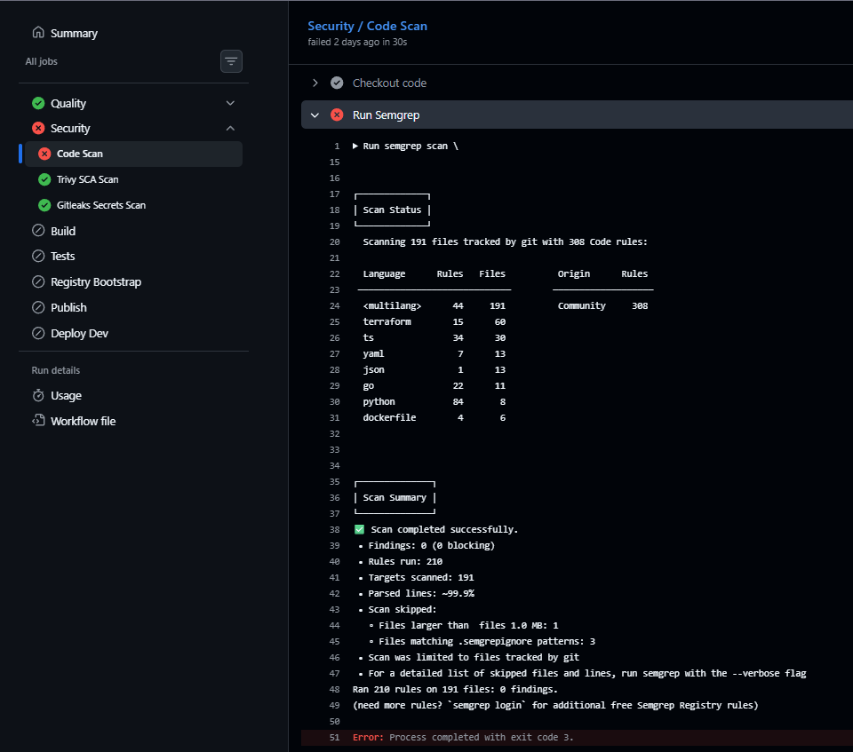

# Calidad de código

Este documento describe la estrategia de análisis de calidad aplicada al proyecto **DevOps Retail Store**.

La calidad de código se valida de forma automática dentro del pipeline de integración continua, como complemento de las pruebas funcionales y de integración documentadas en [Testing](./testing.md).

El detalle de resultados, hallazgos, decisiones y evidencias se documenta en [Informe de calidad y análisis estático](./informes/informe-calidad.md).

## 1. Objetivo

El objetivo de la estrategia de calidad es detectar defectos de código, problemas de mantenibilidad, duplicación y riesgos técnicos antes de promover una versión de Retail Store hacia el siguiente ambiente.

Los objetivos específicos son:

* Detectar errores y problemas de mantenibilidad mediante análisis estático.
* Identificar bugs potenciales y code smells.
* Controlar la duplicación en código nuevo.
* Evitar que una versión con problemas críticos de calidad sea promovida.
* Generar evidencias reproducibles del análisis realizado.

## 2. Alcance

El análisis de calidad se aplicará sobre el código de los microservicios y componentes del proyecto.

## 3. Herramientas seleccionadas

SonarCloud aporta el análisis general con el gate disponible en el plan gratuito con `Sonar way` y  `Semgrep` aporta el umbral configurable; `Newman`, `Trivy` y `Gitleaks` bloquean sus respectivos riesgos.

El análisis permitirá identificar:

* Bugs potenciales.
* Code smells.
* Código duplicado.
* Problemas de mantenibilidad.
* Problemas de confiabilidad.
* Problemas de seguridad detectados durante el análisis estático.

## 4. Integración con GitHub Actions

El análisis de calidad está incorporado como una etapa del pipeline de integración continua.

SonarCloud se ejecuta en pull requests y en la rama `main`. En pushes a otras ramas, el workflow deja un resumen indicando que el análisis de SonarCloud fue omitido.

Configuración principal:

```yaml
- name: Run SonarCloud analysis
  if: github.event_name == 'pull_request' || github.ref_name == 'main'
  uses: SonarSource/sonarqube-scan-action@v8
  with:
    args: >
      -Dsonar.host.url=https://sonarcloud.io
      -Dsonar.qualitygate.wait=true
      -Dsonar.qualitygate.timeout=300
```

El uso de `sonar.qualitygate.wait=true` permitirá bloquear el pipeline cuando el quality gate no sea aprobado.

```yaml
      - name: Run Semgrep
        run: |
          semgrep scan \
            --config=auto \
            --severity=ERROR \
            --strict \
            --error \
            --exclude=node_modules \
            --exclude=dist \
            --exclude=build \
            --exclude=coverage \
            --sarif \
            --output=semgrep-results.sarif \
            .
```

## 5. Quality gate de análisis estático

| Control | Herramienta | Criterio bloqueante |
|---|---|---|
| Calidad general | SonarCloud | Quality Gate `Sonar way` aprobado |
| Análisis estático | Semgrep | Cero hallazgos `ERROR` |
| Dependencias | Trivy filesystem | Cero HIGH/CRITICAL corregibles |
| Imágenes | Trivy image | Cero HIGH/CRITICAL no exceptuadas |
| Secretos | Gitleaks | Cero secretos detectados |
| Integración funcional | Newman | Todas las pruebas y aserciones aprobadas |

Una versión no podrá promoverse cuando el quality gate de calidad se encuentre fallando.

## 6. Promoción entre ambientes

El flujo esperado será:

```text
feature/* → develop → testing → main
```

La promoción hacia `testing` requerirá:

* Build correcto.
* Análisis estático aprobado.
* Controles de seguridad aprobados.
* Pruebas funcionales aprobadas.

La promoción hacia `main` requerirá:

* Suite de integración aprobada en Test.
* Quality gates aprobados.
* Pull Request aprobado por otro integrante.
* Ausencia de errores bloqueantes conocidos.

En un ambiente real, el gate de promoción `Test -> Prod` también debería ejecutar un health check contra el ambiente de Test antes de publicar en Producción, por ejemplo validando el endpoint `/health` mediante una variable como `TEST_BASE_URL`. Para esta entrega del obligatorio, ese control queda documentado pero no se ejecuta automáticamente, ya que el ambiente de Test no necesariamente estará levantado durante la evaluación.

## 7. Resultados obtenidos

Los resultados y observaciones obtenidos durante la ejecución de los controles de calidad se consolidan en [Informe de calidad y análisis estático](./informes/informe-calidad.md).

## 8. Hallazgos significativos

Los hallazgos reales del análisis se documentan en [Informe de calidad y análisis estático](./informes/informe-calidad.md).

| ID        | Hallazgo                | Severidad | Ambiente o rama | Estado    |
| --------- | ----------------------- | --------- | --------------- | --------- |
| GIT-001 | Gitleaks reportó `curl-auth-user` en `.github/workflows/reusable-code-quality.yml` por el uso de `curl --user "${SONAR_TOKEN}:"` contra la API de SonarCloud. El valor no está hardcodeado: se inyecta desde GitHub Secrets en tiempo de ejecución. Se agregó `gitleaks:allow` únicamente en esa línea y el scan de secretos queda enfocado en el estado vigente del repositorio para evitar bloquear Test o Prod por el commit histórico ya corregido. | Baja | Testing / Producción | Falso positivo documentado |

## 9. Remediaciones aplicadas

Las correcciones y decisiones aplicadas se documentan indicando el hallazgo asociado y la evidencia de validación.

| Hallazgo | Remediación | Resultado |
| -------- | ----------- | --------- |
| Limitación de SonarCloud | Se mantuvo `Sonar way` y se agregó Semgrep como gate bloqueante configurable. | Aplicado |
| GIT-001 | Se documentó el falso positivo de Gitleaks y se usó `gitleaks:allow` solo en la línea afectada. | Aplicado |

Cuando un hallazgo no pueda corregirse dentro del alcance del proyecto, deberá documentarse como excepción justificada.

La excepción deberá incluir:

* Motivo.
* Riesgo aceptado.
* Impacto.
* Medida de mitigación.
* Responsable de la decisión.

## 10. Recomendaciones de mejora

Las recomendaciones iniciales son:

* Generar reportes de cobertura para todos los lenguajes utilizados.
* Incorporar cobertura mínima cuando exista una medición real y reproducible.
* Revisar periódicamente duplicación y code smells.
* Mantener la configuración de SonarCloud versionada junto con el código.
* Ajustar los umbrales del quality gate según los resultados obtenidos.

## 11. Evidencias y capturas

Las evidencias se almacenan dentro del repositorio.

Estructura utilizada:

```text
docs/
├── calidad.md
├── informes/
│   └── informe-calidad.md
└── assets/
    └── informe-calidad/
        ├── github-actions-calidad.png
        ├── 2026-06-21_23h06_59.png
        ├── 2026-06-22_01h32_06.png
        └── 2026-06-23_21h34_56.png
```

Las evidencias incluyen:

1. Resultado del análisis de SonarCloud.
2. Restricción del plan gratuito para Quality Gates personalizados.
3. Etapa de calidad dentro de GitHub Actions.
4. Clasificación de hallazgos Semgrep.
5. Evidencia de decisiones y remediaciones aplicadas.

Ejemplo:

```markdown

```
