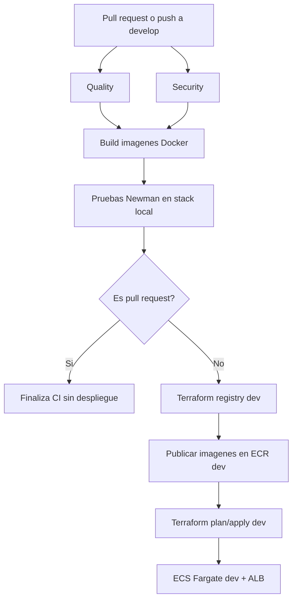
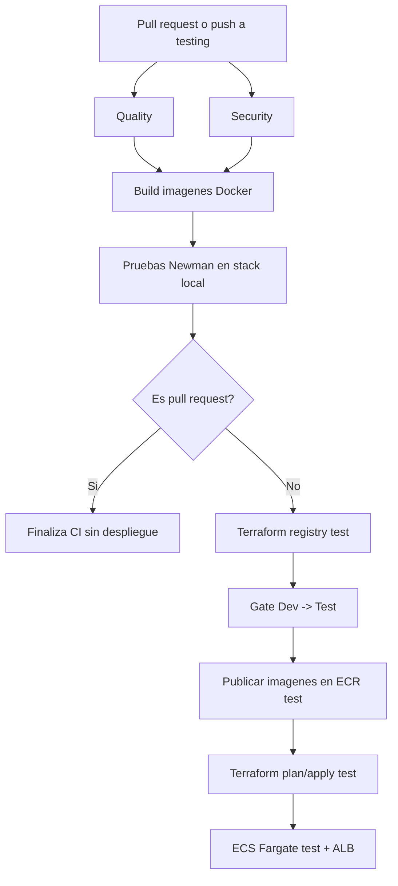
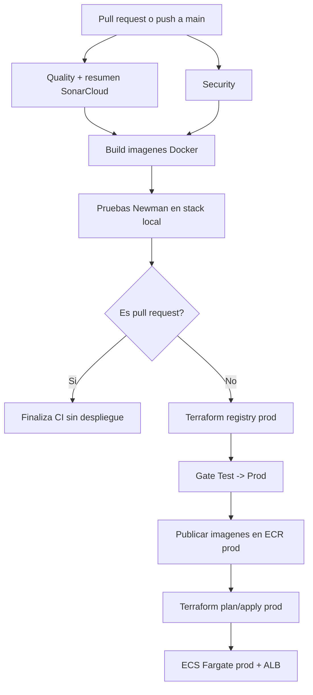

# CI/CD

Este documento describe la estrategia de integración continua y despliegue continuo implementada para **DevOps Retail Store**.

La automatización se implementa con **GitHub Actions** y separa el flujo por rama y ambiente:

| Rama | Workflow | Ambiente | Despliegue |
| --- | --- | --- | --- |
| `develop` | `CI/CD - Develop` | `dev` | Automatico en push o ejecucion manual |
| `testing` | `CI/CD - Testing` | `test` | Automatico en push o ejecucion manual |
| `main` | `CI/CD - Prod` | `prod` | Automatico en push o ejecucion manual |

En pull requests se ejecutan los controles de CI, pero no se publican imagenes ni se despliega infraestructura. El despliegue ocurre solamente cuando el evento no es `pull_request`.

## 1. Objetivo

El objetivo de la estrategia CI/CD es asegurar que cada version avance entre ambientes solo despues de superar controles automatizados de calidad, seguridad, build y pruebas.

Los objetivos especificos son:

* Validar cambios antes de integrarlos a ramas principales.
* Construir las imagenes Docker de todos los microservicios.
* Analizar vulnerabilidades de codigo, dependencias, secretos e imagenes.
* Ejecutar pruebas automatizadas de integracion con Newman.
* Publicar imagenes versionadas en Amazon ECR por ambiente.
* Desplegar infraestructura y servicios en AWS ECS Fargate mediante Terraform.
* Generar evidencias en los resúmenes y artefactos de GitHub Actions.

## 2. Componentes reutilizables

La estrategia evita duplicar logica usando workflows reutilizables:

| Workflow reutilizable | Responsabilidad |
| --- | --- |
| `reusable-code-quality.yml` | Ejecuta SonarCloud cuando corresponde y valida el quality gate. |
| `reusable-security-analysis.yml` | Ejecuta Semgrep, Trivy filesystem y Gitleaks. |
| `reusable-build-images.yml` | Construye imagenes Docker para `catalog`, `orders`, `checkout`, `ui`, `admin` y `cart`, y las escanea con Trivy. |
| `reusable-automated-tests.yml` | Levanta el stack local con Docker Compose, ejecuta Newman y sube reportes JUnit/HTML. |
| `reusable-registry-bootstrap.yml` | Crea o actualiza los repositorios ECR del ambiente con Terraform. |
| `reusable-publish-images.yml` | Publica imagenes Docker en ECR con tags `${{ github.sha }}` y `latest`. |
| `reusable-deploy.yml` | Ejecuta `terraform init`, `plan` y `apply` para desplegar el ambiente en ECS Fargate. |

## 3. Estrategia general

El flujo de promocion del codigo sigue la estrategia de ramificacion documentada en [Estrategia de ramificacion](./estrategia-ramificación.md):

```text
feature/* -> develop -> testing -> main
```

Cada ambiente tiene recursos separados mediante los archivos Terraform de `infra/environment/tfvars/` y `infra/environment/backend/`. Los repositorios de imagenes tambien se separan por prefijo:

| Ambiente | Prefijo ECR | GitHub Environment |
| --- | --- | --- |
| Dev | `devops-retail-store-dev` | `Develop` |
| Test | `devops-retail-store-test` | `Test` |
| Prod | `devops-retail-store-prod` | `Prod` |

Las imagenes se etiquetan con el SHA del commit para mantener trazabilidad entre codigo, artefacto y despliegue. Tambien se publica `latest`, aunque el despliegue usa explicitamente el `IMAGE_TAG` recibido por el workflow.

## 4. Ambiente Dev

El ambiente **Dev** se activa sobre pull requests a `develop`, pushes a `develop` y ejecuciones manuales.

En pull requests, el pipeline funciona como integracion continua: ejecuta calidad, seguridad, build y pruebas automatizadas. En pushes a `develop`, ademas ejecuta despliegue continuo hacia el ambiente `dev`.

Controles principales:

* Calidad de codigo mediante SonarCloud cuando aplica.
* Analisis de seguridad con Semgrep, Trivy filesystem y Gitleaks.
* Build de imagenes Docker para todos los microservicios.
* Escaneo Trivy de imagenes con severidades `HIGH` y `CRITICAL`.
* Pruebas de integracion Newman contra stack local en el runner.
* Bootstrap de ECR para `dev`.
* Publicacion de imagenes en `devops-retail-store-dev`.
* Despliegue de infraestructura runtime en ECS Fargate con Terraform.



## 5. Ambiente Test

El ambiente **Test** se activa sobre pull requests a `testing`, pushes a `testing` y ejecuciones manuales.

Su objetivo es validar una version candidata promovida desde `develop`. Igual que en Dev, los pull requests ejecutan solo CI. En pushes a `testing`, el pipeline agrega un gate explicito **Dev -> Test** antes de publicar y desplegar.

Controles principales:

* Calidad, seguridad, build y pruebas automatizadas.
* Bootstrap de ECR para `test`.
* Gate de promocion **Dev -> Test** registrado en el resumen del workflow.
* Publicacion de imagenes en `devops-retail-store-test`.
* Despliegue de infraestructura runtime en ECS Fargate con Terraform.

El gate **Dev -> Test** consolida que los controles previos fueron aprobados antes de promover el commit. En la implementacion actual queda expresado como un job de verificacion y evidencia dentro de GitHub Actions.



## 6. Ambiente Prod

El ambiente **Prod** se activa sobre pull requests a `main`, pushes a `main` y ejecuciones manuales.

Este ambiente representa la version estable. En pull requests a `main` se ejecutan las validaciones de CI. En pushes a `main`, se publica y despliega en `prod` luego de superar el gate **Test -> Prod**.

Controles principales:

* Calidad de codigo con SonarCloud y publicacion de resumen detallado.
* Analisis de seguridad con Semgrep, Trivy filesystem y Gitleaks.
* Build y escaneo de imagenes Docker.
* Pruebas automatizadas Newman contra stack local.
* Bootstrap de ECR para `prod`.
* Gate de promocion **Test -> Prod** registrado en el resumen del workflow.
* Publicacion de imagenes en `devops-retail-store-prod`.
* Despliegue de infraestructura runtime en ECS Fargate con Terraform.

El workflow deja documentado un health check al ambiente Test como mejora esperada para un contexto productivo real. Para el obligatorio, ese control se mantiene omitido porque el ambiente Test puede no estar disponible durante la evaluacion.



## 7. Infraestructura desplegada

El despliegue continuo usa Terraform para crear y actualizar los recursos de runtime definidos en `infra/environment/`:

* Amazon ECS Fargate para los microservicios.
* Application Load Balancer publico.
* VPC con subredes publicas y privadas.
* Amazon RDS PostgreSQL.
* Amazon ElastiCache Redis.
* AWS Secrets Manager para credenciales.
* CloudWatch Logs.
* Lambda de automatizacion.

Antes del runtime, el pipeline ejecuta `infra/registry/` para asegurar que existan los repositorios ECR del ambiente. El backend remoto de Terraform vive en S3 y usa un `key` distinto para `dev`, `test` y `prod`, lo que separa el estado de cada ambiente.

## 8. Criterios de bloqueo

Una version no avanza al despliegue si falla cualquiera de estos controles:

| Control | Bloquea cuando |
| --- | --- |
| SonarCloud | El quality gate no aprueba o falta configuracion requerida cuando debe ejecutarse. |
| Semgrep | Hay hallazgos `ERROR`. |
| Trivy filesystem | Hay vulnerabilidades `HIGH` o `CRITICAL` no exceptuadas. |
| Gitleaks | Se detectan secretos en el repositorio. |
| Build Docker | No se puede construir alguna imagen. |
| Trivy image | La imagen contiene vulnerabilidades `HIGH` o `CRITICAL` no exceptuadas. |
| Newman | Falla alguna prueba o asercion de integracion. |
| Terraform | Falla `init`, `plan` o `apply`. |

## 9. Trazabilidad y evidencias

Cada ejecucion mantiene trazabilidad mediante:

* SHA del commit usado como tag de imagen.
* Resumen de GitHub Actions para SonarCloud, Newman, gates de promocion y URLs desplegadas.
* Artefactos HTML/JUnit de Newman.
* Estados Terraform separados por ambiente.
* Repositorios ECR separados por ambiente y microservicio.

Esta estrategia permite identificar que commit fue validado, que imagen fue publicada y que version quedo desplegada en cada ambiente.
