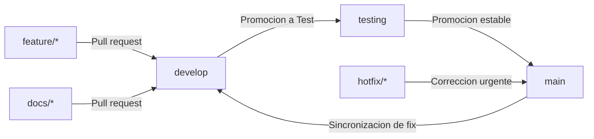
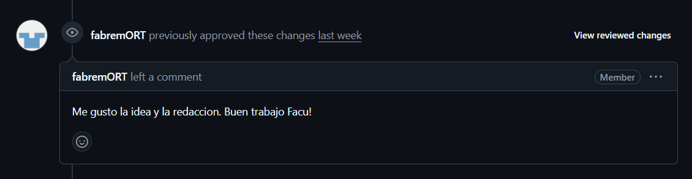
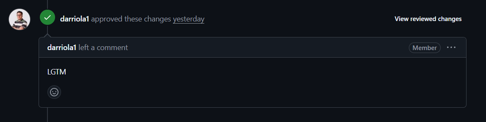
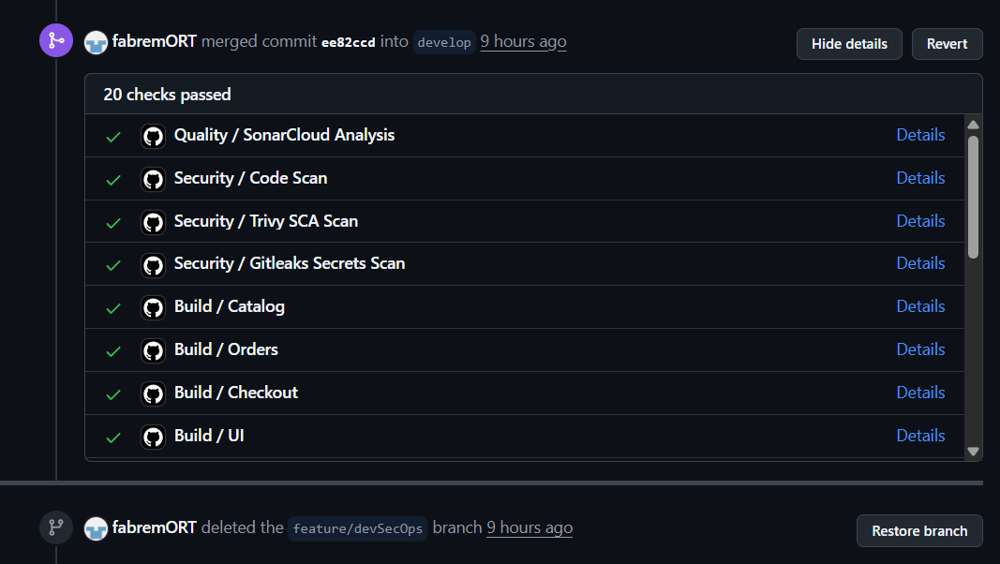
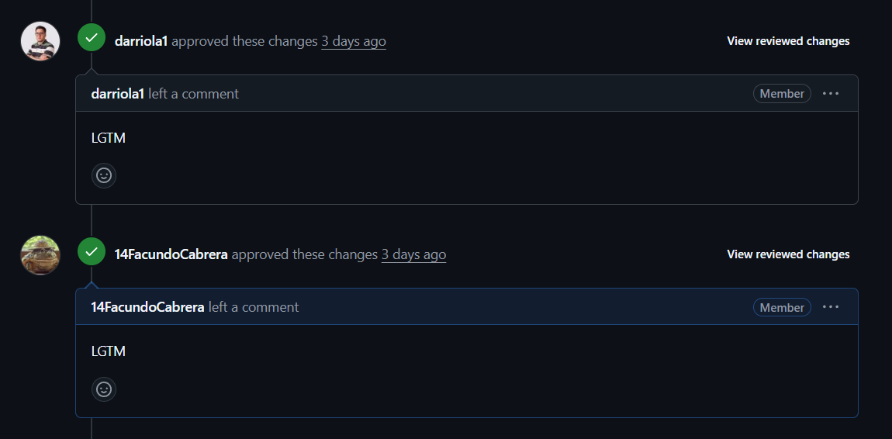
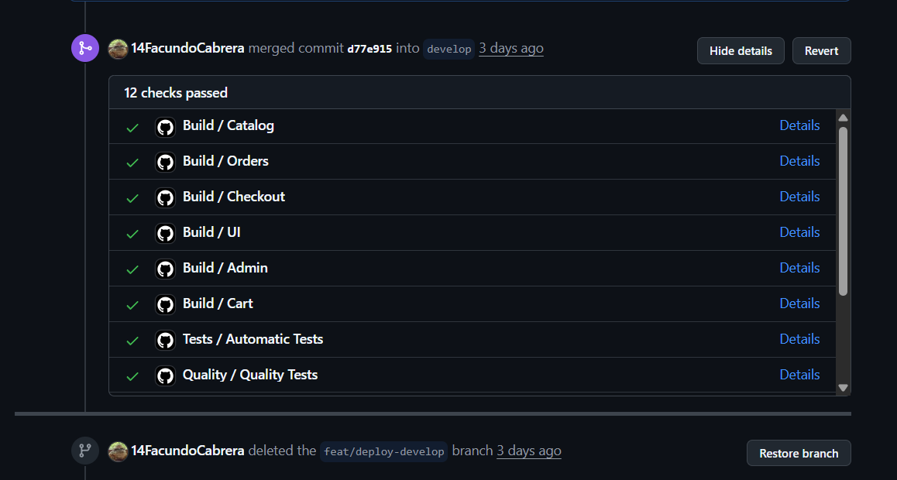

# Estrategia Git

Este documento explica la estrategia de ramificación utilizada, desde el porqué se escogió hasta cómo se aplicó.

## Estrategia elegida

Para este obligatorio, se optó por utilizar una adaptación simplificada de _Gitflow_, con un mínimo cambio por temas de seguridad.
La estructura es la siguiente:

- `main`
- `testing`
- `develop`
- `feature/*`
- `hotfix/*`
- `docs/*`

Aunque Gitflow tradicional utiliza `master` como rama principal, se adoptó `main` siguiendo convenciones modernas de desarrollo.

## ¿Por qué se eligió _Gitflow_?

_Gitflow_ tiene ramas claras para cada proceso de este trabajo, lo cual facilita demostrar conocimientos en CI/CD y mantener un mejor control sobre lo que se desarrolla.

Este control permite evitar errores, detectar problemas temprano, mantener un flujo de trabajo dinámico y separar la validación del desarrollo.

Además de las ventajas para el equipo de desarrollo, también aporta beneficios enfocados en la entrega del obligatorio, como evidencia de PRs y procesos de CI/CD diferenciados según la rama.

## ¿Cómo se aplica esta estrategia?

El flujo de trabajo principal es:

```text
feature/* -> develop -> testing -> main
```



Cada vez que se crea una nueva rama `feature/*`, se espera que esté basada en `develop`. Luego se crea una _pull request_ hacia `develop`, donde el conjunto de funcionalidades se integra y valida técnicamente. Cuando corresponde promover una versión estable, los cambios pasan a `testing`. Una vez que la validación en `testing` finaliza correctamente y no existen errores bloqueantes, se genera una _pull request_ hacia `main`, donde se libera una nueva versión estable del proyecto.

## ¿Cómo se utilizó?

A lo largo del proyecto, esta estrategia ayudó en los siguientes aspectos:

- Organización de ramas.
- Aplicación de una técnica correcta y prolija de CI/CD.
- Reducción de errores que podrían surgir con commits directos a `main`.
- Mayor claridad para entender el trabajo del equipo.

### Ejemplos documentados

#### [Pull Request #82 - DevSecOps Workflow](https://github.com/DevOpsObl/devops-retail-store/pull/82)

- Autor: Facundo Cabrera.
- Reviewers: Denis Arriola, Facundo Bremermann.
- From `feature/devSecOps` into `develop`.

También se pueden ver los **comentarios** que se realizaron para aprobar o desaprobar el merge.





Y por supuesto, el **merge** donde se pasaron los checks establecidos.



---

#### [Pull Request #87 - Feat/deploy develop](https://github.com/DevOpsObl/devops-retail-store/pull/87)

- Autor: Facundo Bremermann.
- Reviewers: Denis Arriola, Facundo Cabrera.
- From `feature/deploy-develop` into `develop`.

También se pueden ver los **comentarios** que se realizaron para aprobar o desaprobar el merge.



Y por supuesto, el **merge** donde se pasaron los checks establecidos.


