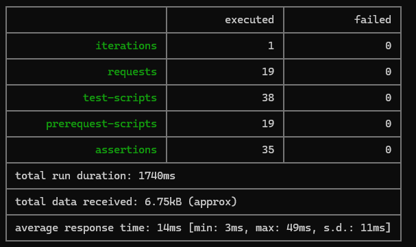
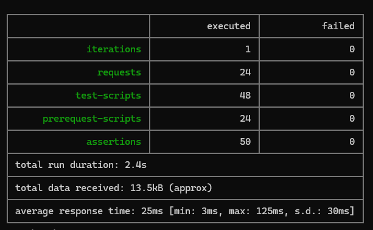
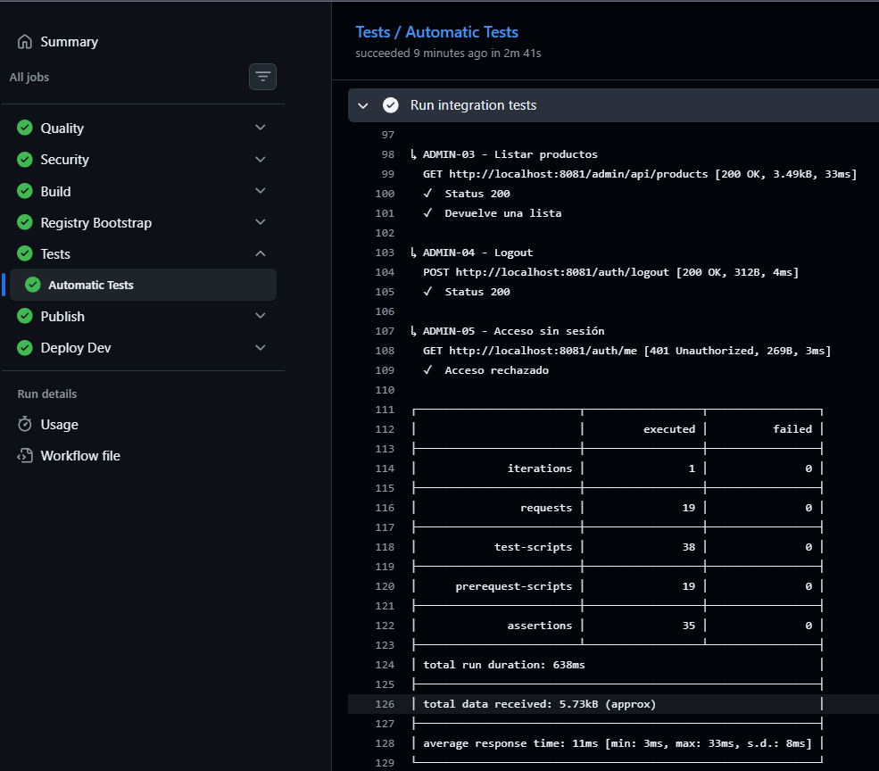

# Informe de testing — hallazgos, remediaciones y resultados

**Proyecto:** RetailStore  
**Período analizado:** 16/06/2026 al 20/06/2026  
**Herramientas:** Postman, Newman, JUnit, Docker Compose y GitHub Actions

## 1. Objetivo

El objetivo de este informe es documentar los defectos detectados durante la implementación de las pruebas funcionales y de integración de RetailStore, las acciones realizadas para corregirlos y la evidencia utilizada para validar cada remediación.

La estrategia adoptada consistió en:

1. Diseñar y depurar la colección manualmente en Postman.
2. Ejecutar la misma colección con Newman desde línea de comandos.
3. Integrar la ejecución en GitHub Actions como control previo a la publicación y al despliegue.
4. Generar reportes JUnit, HTML y Allure como evidencia.

## 2. Evolución de la suite

La primera versión de la colección, utilizada el 16/06/2026, contenía **19 requests y 35 assertions** y cubría disponibilidad, catálogo, carrito, órdenes y administración.


La versión actual del repositorio amplió la cobertura a **24 requests y 50 assertions**, incorporando también el flujo de checkout. Por este motivo, las capturas históricas y el reporte final del repositorio presentan cantidades diferentes sin que exista una contradicción: corresponden a versiones distintas de la suite.



## 3. Resumen cronológico

| Fecha y hora | Resultado | Hallazgo principal | Acción realizada |
|---|---:|---|---|
| 16/06/2026 20:50:13 | 25/35 pruebas aprobadas | Rutas de Admin ejecutadas contra el puerto de UI y variable `customerId` sin resolver. | Se corrigieron las URL de Admin y se revisó la configuración del ambiente. |
| 16/06/2026 20:52:09 | 34/35 pruebas aprobadas | `customerId` llegó al servicio como texto literal `{{customerId}}`. | Se seleccionó el ambiente `RetailStore - Local` y se corrigio la variable. |
| 16/06/2026 21:01:18 | 34/35 pruebas aprobadas | La respuesta ya contenía el cliente correcto, pero la assertion comparaba contra `undefined`. | Se corrigió el alcance utilizado por el script de prueba. |
| 16/06/2026 21:05:27 | 1/3 assertions aprobadas en `CART-02` | Inconsistencia de alcance para `customerId` y `productId`. | Se alinearon las lecturas de variables y la validación del producto seleccionado. |
| 16/06/2026 21:07:49 | 35/35 pruebas aprobadas | Validación manual completa. | Se consideró cerrada la depuración inicial de la colección. |
| 16/06/2026 23:42:23 | 19 requests y 35 assertions, 0 fallas | Validación desde línea de comandos. | Se confirmó que la colección era ejecutable con Newman. |
| 18/06/2026 21:24:31 | PR #86 abierto | Incorporación formal de colección y ambiente al repositorio. | Se versionaron los activos de testing y se solicitaron revisiones. |
| 20/06/2026 20:33:36 | 8 assertions fallidas | Actualización de dependencias rompió endpoints del servicio Cart. | Se revisó la compatibilidad entre FastAPI, Starlette y la instrumentación de Prometheus. |
| 20/06/2026 21:09:45 | 35/35 assertions aprobadas | Primera validación posterior a la corrección. | Se fijaron versiones compatibles y se reconstruyó el servicio. |
| 20/06/2026 22:27:15 | 35/35 assertions aprobadas | Segunda validación consecutiva. | Se confirmó que la corrección era repetible. |
| 24/06/2026 20:25:43 | 24 requests y 50/50 assertions aprobadas | Validación final de la suite ampliada en el ambiente local de desarrollo. | Se confirmó el funcionamiento completo de los flujos cubiertos y la repetibilidad de las nuevas request aplicadas. |

## 4. Hallazgos y remediaciones

### 4.1. Rutas de administración ejecutadas contra el servicio incorrecto

**Fecha de detección:** 16/06/2026 20:50:13

La primera ejecución completa obtuvo **25 pruebas aprobadas y 10 fallidas**. Los casos `ADMIN-01` a `ADMIN-05` fueron enviados a rutas como:

```text
http://localhost:8080/auth/login
http://localhost:8080/auth/me
http://localhost:8080/admin/api/products
```

El puerto `8080` correspondía a la UI, mientras que el servicio Admin estaba expuesto en el puerto `8081`. Las respuestas fueron `404` y devolvieron HTML, lo que también produjo errores al intentar interpretar el cuerpo como JSON.

**Causa raíz**

La colección no utilizaba de forma consistente la variable `adminBaseUrl`, o se ejecutó sin el ambiente que definía correctamente las URL.

**Remediación aplicada**

- Se definió `adminBaseUrl=http://localhost:8081`.
- Se actualizaron las requests administrativas para utilizar `{{adminBaseUrl}}`.
- Se seleccionó el ambiente `RetailStore - Local` antes de ejecutar la colección.

**Validación**

A las **20:52:09**, los diez errores de Admin dejaron de aparecer. La ejecución pasó de **25/35** a **34/35** pruebas aprobadas.

---

### 4.2. Variable `customerId` sin resolver

**Fecha de detección:** 16/06/2026 20:52:09

El caso `CART-02 - Consultar carrito` respondió HTTP `200`, pero el cuerpo contenía:

```json
{
  "customerId": "{{customerId}}"
}
```

La captura muestra que la ejecución se realizó con `Environment: none`. Postman envió el marcador como texto literal porque no encontró un valor aplicable para la variable.

**Causa raíz**

La colección dependía del ambiente local, pero el Runner fue ejecutado sin seleccionarlo.

**Remediación aplicada**

- Se creó y seleccionó el ambiente `RetailStore - Local`.
- Se definió `customerId=postman-devops-test`.
- Se mantuvo el mismo valor para todas las operaciones de limpieza, alta, consulta, actualización y eliminación del carrito.

**Validación**

A las **21:01:18**, la URL se resolvió como:

```text
http://localhost:8080/api/carts/postman-devops-test
```

y la respuesta devolvió correctamente:

```json
{
  "customerId": "postman-devops-test"
}
```

---

### 4.3. Assertion utilizando un alcance de variable incorrecto

**Fecha de detección:** 16/06/2026 21:01:18

Aunque el servicio ya devolvía `postman-devops-test`, la prueba continuó fallando con:

```text
expected 'postman-devops-test' to deeply equal undefined
```

Esto demostró que la request podía resolver la variable, pero el script de validación intentaba leerla desde un alcance diferente.

**Causa raíz**

La variable estaba disponible para la request por la resolución general de Postman, pero la assertion la obtenía desde un scope que no contenía el dato, `pm.environment.get(...)` cuando el valor estaba definido a nivel de colección.

**Remediación aplicada**

- Se corrigio el lugar donde se define `customerId`.
- Se actualizaron los scripts para leer variables del environment.
- Se evitó mezclar variables de colección y de ambiente para una misma comparación.

**Validación**

La ejecución registrada a las **21:07:49** finalizó con **35 pruebas aprobadas y 0 fallidas**.

---

### 4.4. Validación incorrecta del producto agregado al carrito

**Fecha de detección:** 16/06/2026 21:05:27

En la ejecución individual de `CART-02` se aprobaron solo **1 de 3 assertions**:

- `Status 200`: aprobada.
- `Cliente correcto`: fallida.
- `Contiene el producto`: fallida.

La segunda falla indicó que el producto agregado existía en la respuesta, pero la comparación utilizaba un identificador ausente o recuperado desde otro scope.

**Causa raíz**

El identificador capturado desde catálogo y el identificador utilizado por la assertion de carrito no provenían del mismo alcance de variables.

**Remediación aplicada**

- Se conservó el `productId` real obtenido en los casos de catálogo.
- Se reutilizó ese valor en las operaciones del carrito.
- La assertion se ajustó para buscar el mismo identificador almacenado por el ambiente.

**Validación**

La corrida completa de las **21:07:49** aprobó las **35 assertions**.

---

### 4.5. Regresión del servicio Cart por actualización de dependencias

**Fecha de detección:** 20/06/2026 20:33:36

Luego de actualizar dependencias para reducir vulnerabilidades, Newman ejecutó las **19 requests**, pero registró:

- **2 test scripts fallidos**.
- **8 assertions fallidas**.
- Duración total: **1890 ms**.
- Tiempo promedio de respuesta: **17 ms**.

Los errores se concentraron en el servicio Cart. La actualización había introducido una incompatibilidad entre FastAPI, Starlette y `prometheus-fastapi-instrumentator`, afectando la instrumentación y provocando errores en endpoints que anteriormente funcionaban.

**Causa raíz**

Se actualizaron paquetes de seguridad sin validar en conjunto sus restricciones de compatibilidad. La versión seleccionada de Starlette no era compatible con el resto del stack del servicio.

**Remediación aplicada**

- Se revisaron las restricciones de versiones de FastAPI, Starlette y la instrumentación de Prometheus.
- Se fijaron versiones compatibles en `src/cart/requirements.txt`.
- Se reconstruyó la imagen del microservicio.
- Se ejecutó nuevamente la colección completa con Newman.

**Validación**

Primera ejecución posterior a la corrección, **20/06/2026 21:09:45**:

| Métrica | Resultado |
|---|---:|
| Requests | 19 |
| Assertions | 35 |
| Fallidas | 0 |
| Duración | 1740 ms |
| Tiempo promedio | 14 ms |

Segunda ejecución, **20/06/2026 22:27:15**:

| Métrica | Resultado |
|---|---:|
| Requests | 19 |
| Assertions | 35 |
| Fallidas | 0 |
| Duración | 1937 ms |
| Tiempo promedio | 26 ms |

Las dos ejecuciones consecutivas confirmaron que la remediación no fue un resultado aislado.

## 5. Ejecución con Newman

El 16/06/2026 a las 23:42:23 se validó la ejecución automatizada desde PowerShell.

Resultado registrado:

| Métrica | Resultado |
|---|---:|
| Iteraciones | 1 |
| Requests | 19 |
| Test scripts | 38 |
| Pre-request scripts | 19 |
| Assertions | 35 |
| Fallas | 0 |
| Duración | 1826 ms |
| Datos recibidos | 6.75 KB |
| Tiempo promedio | 12 ms |
| Tiempo mínimo | 2 ms |
| Tiempo máximo | 26 ms |

Esto confirmó que la suite no dependía exclusivamente de la interfaz gráfica de Postman y podía ser incorporada al pipeline.

## 6. Integración al repositorio y CI/CD

El 18/06/2026 a las 21:24:31 se abrió el **Pull Request #86**, `Add Postman environment and collection for RetailStore integration tests`.


La incorporación incluyó:

- Colección Postman.
- Ambiente local.
- Pruebas de health, catálogo, carrito, órdenes y administración.
- Preparación para ejecución con Newman.

Posteriormente, el workflow reutilizable de testing fue configurado para:

1. Levantar el stack con Docker Compose.
2. Esperar los health checks.
3. Ejecutar Newman.
4. Generar reportes.
5. Publicar artefactos.
6. Fallar cuando una request o assertion no cumple el resultado esperado.

El código de salida de Newman funciona como quality gate: ante una assertion fallida, el job de testing termina con error y no debería permitirse la promoción del artefacto.

## 7. Resultado final

La evidencia histórica demuestra la siguiente evolución:

```text
25/35 aprobadas
   ↓ corrección de rutas Admin
34/35 aprobadas
   ↓ corrección de ambiente y alcance de variables
35/35 aprobadas
   ↓ automatización con Newman
19 requests / 35 assertions / 0 fallas
   ↓ regresión por actualización de dependencias
8 assertions fallidas
   ↓ compatibilidad de dependencias corregida
35/35 aprobadas en dos ejecuciones consecutivas
```

La versión actual del repositorio amplió la suite a **24 requests y 50 assertions**, con un reporte JUnit exitoso y cobertura adicional de checkout.

## 8. Riesgos pendientes y recomendaciones

| Prioridad | Recomendación | Motivo |
|---|---|---|
| Media | Agregar pruebas unitarias para reglas internas de Cart y Checkout. | La suite actual detecta fallos externos, pero no aísla la causa. |
| Media | Ejecutar la suite después de cada actualización de dependencias. | El incidente del 20/06 demostró que una remediación de seguridad puede introducir regresiones funcionales. |
| Baja | Incorporar pruebas de carga con k6 o herramienta equivalente. | Permitirá evaluar comportamiento bajo concurrencia, no cubierto por las pruebas actuales. |

## 9. Evidencias utilizadas

| Evidencia | Contenido |
|---|---|
| `2026-06-16_20h51_07.png` | Primera ejecución: 25 aprobadas y 10 fallidas. |
| `2026-06-16_20h52_39.png` | `customerId` enviado como `{{customerId}}`. |
| `2026-06-16_21h01_51.png` | Respuesta correcta, assertion comparando contra `undefined`. |
| `2026-06-16_21h05_27.png` | Fallas de cliente y producto en `CART-02`. |
| `2026-06-16_21h08_35.png` | Historial con ejecución final 35/35. |
| `2026-06-16_23h32_10.png` | Variables de colección y ambiente. |
| `2026-06-16_23h42_23.png` | Newman: 19 requests, 35 assertions y 0 fallas. |
| `2026-06-18_21h24_31.png` | Pull Request #86. |
| `2026-06-20_20h33_36.png` | Regresión del servicio Cart. |
| `2026-06-20_21h09_45.png` | Primera ejecución exitosa posterior a la corrección. |
| `2026-06-20_22h27_15.png` | Segunda ejecución exitosa posterior a la corrección. |
| `tests/postman/retailstore-integration.postman_collection.json` | Colección actual. |
| `tests/postman/environments/local.postman_environment.json` | Ambiente local. |
| `reports/newman/local-results.xml` | Resultado JUnit exitoso de la versión actual. |
| `.github/workflows/reusable-automated-tests.yml` | Automatización de pruebas. |
