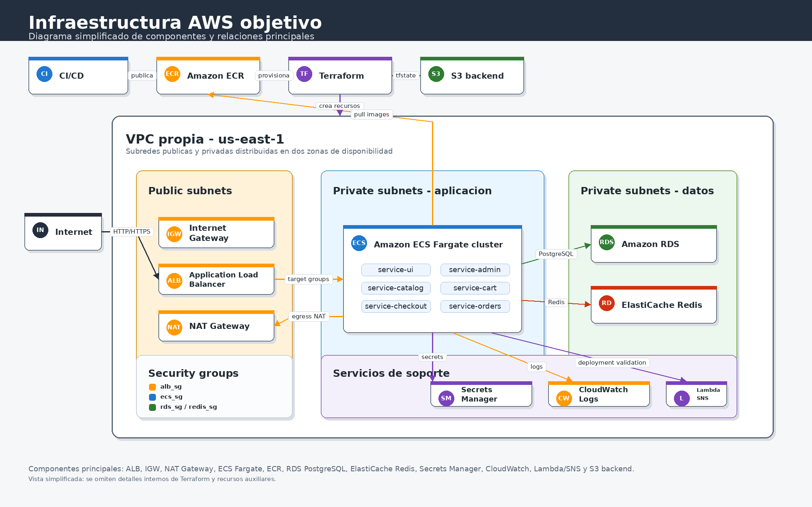

# Infraestructura cloud objetivo

La infraestructura se implementara completamente como codigo utilizando **Terraform** sobre **AWS** en la region `us-east-1`.

La primera version productiva se desplegara sobre **Amazon ECS con Fargate**. Los microservicios `ui`, `admin`, `catalog`, `cart`, `checkout` y `orders` se empaquetaran como imagenes Docker, se publicaran en **Amazon ECR** y luego se ejecutaran como servicios independientes dentro de un cluster ECS. De esta forma, no se crearan ni administraran instancias EC2 para alojar la aplicacion.

Los datos no se alojaran dentro de los contenedores. PostgreSQL se implementara como **Amazon RDS** y Redis como **Amazon ElastiCache**, ambos en subredes privadas. Esto permite que las tareas de ECS Fargate sean reemplazables y que el estado de la aplicacion quede en servicios administrados.

Se desplegara una VPC propia con subredes publicas y privadas distribuidas en dos zonas de disponibilidad. Las subredes publicas alojaran el **Application Load Balancer** y los componentes de entrada. Las subredes privadas alojaran las tareas ECS Fargate, RDS y ElastiCache, sin exposicion publica directa. La salida a internet desde las subredes privadas se realizara mediante **NAT Gateway**.

El codigo Terraform se organizara en modulos reutilizables. Se creara un modulo de red para la VPC, subredes, tablas de ruteo, Internet Gateway y NAT Gateway. Tambien se implementaran modulos separados para seguridad, balanceo, registro de imagenes, orquestacion de contenedores, base de datos, cache, secretos, monitoreo y automatizaciones serverless.

La estructura sera:

```text
infra/
├── bootstrap/
│   ├── versions.tf
│   ├── main.tf
│   ├── variables.tf
│   ├── outputs.tf
│   └── tfvars/
│       └── shared.tfvars
├── registry/
│   ├── backend.tf
│   ├── versions.tf
│   ├── main.tf
│   ├── variables.tf
│   ├── outputs.tf
│   ├── backend/
│   │   ├── dev.hcl
│   │   ├── test.hcl
│   │   └── prod.hcl
│   └── tfvars/
│       ├── dev.tfvars
│       ├── test.tfvars
│       └── prod.tfvars
├── environment/
│   ├── backend.tf
│   ├── versions.tf
│   ├── main.tf
│   ├── variables.tf
│   ├── outputs.tf
│   ├── backend/
│   │   ├── dev.hcl
│   │   ├── test.hcl
│   │   └── prod.hcl
│   └── tfvars/
│       ├── dev.tfvars
│       ├── test.tfvars
│       └── prod.tfvars
└── modules/
    ├── networking/
    ├── security/
    ├── alb/
    ├── ecr/
    ├── ecs/
    ├── database/
    ├── redis/
    ├── secrets/
    ├── monitoring/
    └── lambda/
```

La configuracion usara el mismo codigo Terraform para todos los ambientes. Los parametros se separaran mediante archivos `.tfvars` diferenciados:

```text
dev.tfvars
test.tfvars
prod.tfvars
```

La infraestructura se separara en tres responsabilidades principales:

| Stack | Carpeta | Responsabilidad |
|-------|---------|-----------------|
| Bootstrap | `infra/bootstrap` | Crear el bucket S3 usado como backend remoto de Terraform. |
| Registry | `infra/registry` | Crear los repositorios Amazon ECR por ambiente y microservicio. |
| Runtime | `infra/environment` | Crear la VPC, seguridad, ALB, ECS Fargate, RDS, Redis, secretos, monitoreo y Lambda. |

Esta separacion evita una dependencia circular del primer despliegue. Las imagenes Docker necesitan repositorios ECR existentes para poder publicarse, pero los servicios ECS necesitan imagenes ya publicadas para arrancar correctamente. Por eso, el registry se provisiona antes de publicar imagenes y el runtime se aplica despues, cuando el tag de imagen ya existe en ECR.

El flujo esperado de CI/CD sera:

```text
build_images
automated_tests
code_quality + security_analysis
registry_bootstrap
publish_images
deploy
```

`registry_bootstrap` ejecutara el stack `infra/registry`. Luego `publish_images` subira las imagenes Docker al ECR correspondiente. Finalmente `deploy` ejecutara `infra/environment`, que configura ECS usando el `image_tag` ya publicado.

Se evaluo una alternativa donde el bootstrap levantara toda la infraestructura posible antes de publicar imagenes, dejando para `deploy` solo la creacion de ECS y el despliegue de aplicaciones. Esa opcion se descarto porque el ALB y sus reglas necesitan conectarse con target groups y servicios ECS para completar el enrutamiento operativo. Si los servicios no existen todavia, la infraestructura queda parcialmente creada pero sin una vinculacion completa entre balanceador y aplicaciones; ademas, al crear servicios ECS antes de publicar imagenes se vuelve al problema original de tareas intentando descargar tags inexistentes. Por eso se mantuvo un bootstrap acotado al registry y el despliegue runtime completo se realiza despues de publicar las imagenes.

Cada ambiente definira sus propios valores de red, nombres de recursos, tags, parametros de escalado, CPU y memoria de las tareas Fargate y cantidad deseada de replicas por servicio. El estado remoto compartira el mismo bucket S3, pero usara un `key` distinto por stack y ambiente, por ejemplo `registry/dev/terraform.tfstate`, `dev/terraform.tfstate`, `registry/test/terraform.tfstate` y `test/terraform.tfstate`. El bloqueo de concurrencia del estado se realizara con lockfile nativo del backend S3.

## Networking

El networking se implementara mediante un modulo Terraform dedicado a la capa de red. Este modulo creara la VPC principal, las subredes publicas y privadas, las tablas de ruteo, el Internet Gateway, el NAT Gateway y las asociaciones necesarias entre subredes y rutas.

La VPC se distribuira en dos zonas de disponibilidad de `us-east-1`. En cada zona se definira una subnet publica y una subnet privada. Las subredes publicas alojaran los componentes expuestos a internet, principalmente el **Application Load Balancer** y el **NAT Gateway**. Las subredes privadas alojaran las tareas ECS Fargate de aplicacion y los servicios administrados de persistencia, como **Amazon RDS** y **Amazon ElastiCache**.

El trafico entrante desde internet llegara al **Application Load Balancer**, ubicado en las subredes publicas. El ALB enviara las solicitudes hacia los target groups de los servicios ECS Fargate, sin exponer directamente las tareas a internet.

Las subredes publicas tendran una ruta por defecto hacia el **Internet Gateway**, permitiendo que el ALB reciba trafico publico. Las subredes privadas no tendran ruta directa al Internet Gateway. Para acceder a internet de forma saliente, por ejemplo para descargar imagenes desde ECR o comunicarse con servicios administrados cuando corresponda, las subredes privadas utilizaran un **NAT Gateway** ubicado en una subnet publica.

## Alojamiento de microservicios

Los microservicios se construiran como imagenes Docker y se publicaran en repositorios de **Amazon ECR** creados por el stack `infra/registry`. Cada microservicio tendra su propia imagen versionada para permitir despliegues independientes y trazables.

```text
Amazon ECR por ambiente, ejemplo dev
├── devops-retail-store-dev/ui
├── devops-retail-store-dev/admin
├── devops-retail-store-dev/catalog
├── devops-retail-store-dev/cart
├── devops-retail-store-dev/checkout
└── devops-retail-store-dev/orders
```

Para `test` y `prod` se mantiene la misma convencion, cambiando el prefijo a `devops-retail-store-test` o `devops-retail-store-prod`.

Luego, esas imagenes se ejecutaran en **Amazon ECS con Fargate**, creado por el stack `infra/environment`. Cada microservicio se definira mediante una task definition y un servicio ECS propio. Fargate administrara la capacidad de computo sin que sea necesario crear, mantener o acceder a instancias EC2.

```text
ECS Fargate cluster
├── service-ui
├── service-admin
├── service-catalog
├── service-cart
├── service-checkout
└── service-orders
```

## Persistencia

La persistencia se separara de los contenedores de aplicacion:

| Componente | Servicio AWS | Uso |
|------------|--------------|-----|
| `catalog`  | Amazon RDS PostgreSQL | Base `catalogdb` para productos y tags |
| `cart`     | Amazon RDS PostgreSQL | Base `cartdb` para items del carrito |
| `orders`   | Amazon RDS PostgreSQL | Base `orders` para ordenes e items |
| `checkout` | Amazon ElastiCache Redis | Estado temporal del proceso de checkout |

RDS y ElastiCache se ubicaran en subredes privadas y solo aceptaran conexiones desde el security group de los servicios ECS Fargate de aplicacion.

## Seguridad de red

Se definiran security groups separados:

| Security group | Reglas principales |
|----------------|--------------------|
| `alb_sg` | Permite HTTP/HTTPS desde internet |
| `ecs_sg` | Permite trafico desde `alb_sg` hacia las tareas ECS Fargate |
| `rds_sg` | Permite PostgreSQL `5432` solo desde `ecs_sg` |
| `redis_sg` | Permite Redis `6379` solo desde `ecs_sg` |
| `lambda_sg` | Permite acceso privado si la Lambda necesita consultar recursos internos |

Las tareas ECS Fargate no tendran IP publica. La operacion se realizara mediante los servicios administrados de AWS, logs en **Amazon CloudWatch Logs** y comandos operativos de ECS cuando sean necesarios, evitando abrir SSH o administrar hosts manualmente.

Como el despliegue se realizara dentro de un laboratorio de AWS, los recursos IAM usaran el rol existente **`LabRole`**. Este rol se asociara a las definiciones de tareas ECS como task execution role y, cuando aplique, como task role para permitir la descarga de imagenes desde ECR, el envio de logs a CloudWatch y el acceso controlado a otros servicios necesarios del laboratorio.

Los outputs de Terraform expondran los datos relevantes de la infraestructura y estaran documentados con descripcion, como se detalla en la seccion de outputs.

El estado de Terraform se almacenara en un backend remoto sobre **S3**. El bucket de estado tendra cifrado habilitado, versionado y bloqueo de concurrencia mediante lockfile nativo del backend S3. No se utilizara estado local para la infraestructura objetivo.

Los secretos se gestionaran de forma segura. No se almacenaran credenciales, claves, tokens ni contrasenas en el codigo Terraform ni en archivos `.tfvars` versionados. Los valores sensibles se obtendran desde **AWS Secrets Manager** o **SSM Parameter Store**, y las variables sensibles se declararan con `sensitive = true`.

El modulo `secrets` crea el secreto `${project_name}-${environment}/app-secrets` en **AWS Secrets Manager** y guarda alli las credenciales generadas para la base de datos y el usuario administrador. Para facilitar la destruccion y recreacion frecuente de ambientes de laboratorio, el secreto se configura con `recovery_window_in_days = 0`. De esta forma, cuando Terraform destruye el ambiente, Secrets Manager elimina el secreto sin dejarlo en estado `scheduled for deletion`, evitando que una ejecucion posterior falle al intentar crear un secreto con el mismo nombre. Si un secreto ya quedo programado para eliminacion antes de aplicar esta configuracion, debe purgarse manualmente con `aws secretsmanager delete-secret --secret-id <nombre-del-secreto> --force-delete-without-recovery --region us-east-1` antes de reintentar el despliegue.

Se incorporara **AWS Lambda** como servicio serverless para automatizaciones operativas y de seguridad. La funcion Lambda procesara eventos de **CloudWatch** para generar alertas, analizar logs de seguridad y notificar eventos relevantes. Terraform creara la funcion, la asociara al rol **`LabRole`** disponible en el laboratorio cuando corresponda, y definira sus permisos de ejecucion y reglas de invocacion.

La infraestructura resultante quedara definida, versionada y desplegable mediante Terraform, con separacion por ambientes, modulos reutilizables, estado remoto seguro, manejo protegido de secretos y automatizacion serverless integrada.

## Outputs

Los outputs mas relevantes se definiran en `infra/registry/outputs.tf` y `infra/environment/outputs.tf`. `registry` expone las URLs de repositorios ECR para publicar imagenes, mientras que `environment` consolida las salidas operativas del ambiente desplegado.

| Output | Origen | Uso principal |
|--------|--------|---------------|
| `alb_dns_name` | Modulo `alb` | DNS publico del Application Load Balancer para acceder a la aplicacion y probar endpoints. |
| `vpc_id` | Modulo `networking` | Identificador de la VPC del ambiente, util para inspeccion, troubleshooting y asociacion con otros recursos. |
| `public_subnet_ids` | Modulo `networking` | IDs de las subredes publicas donde se ubican el ALB y el NAT Gateway. |
| `private_subnet_ids` | Modulo `networking` | IDs de las subredes privadas donde corren ECS Fargate, RDS y Redis. |
| `ecr_repository_urls` | `infra/registry` | URLs de los repositorios ECR donde se publican las imagenes Docker de cada microservicio. |
| `ecs_cluster_name` | Modulo `ecs` | Nombre del cluster ECS Fargate usado para operar los servicios y consultar su estado. |
| `ecs_service_names` | Modulo `ecs` | Nombres de los servicios ECS creados para `ui`, `admin`, `catalog`, `cart`, `checkout` y `orders`. |
| `rds_endpoint` | Modulo `database` | Endpoint de PostgreSQL RDS utilizado por los servicios que requieren persistencia relacional. |
| `redis_endpoint` | Modulo `redis` | Endpoint y puerto de ElastiCache Redis utilizado por `checkout`. |
| `secret_arn` | Modulo `secrets` | ARN del secreto de AWS Secrets Manager con credenciales de aplicacion y base de datos. |
| `lambda_function_name` | Modulo `lambda` | Nombre de la Lambda usada para automatizaciones operativas y de seguridad. |
| `state_bucket_name` | `infra/bootstrap` | Nombre del bucket S3 creado para almacenar el estado remoto de Terraform. |

Ademas, los modulos internos exponen salidas complementarias como ARNs de repositorios ECR, ARN del cluster ECS, ARNs de target groups, identificador de la instancia RDS, security groups, log groups de CloudWatch y ARN de la Lambda. Estas salidas permiten conectar modulos entre si y realizar tareas de diagnostico, pero no todas necesitan mostrarse como outputs finales del ambiente.

Las salidas sensibles se manejaran con cuidado. Por ejemplo, el modulo de secretos marca `db_password` como `sensitive = true` para evitar que Terraform imprima la contrasena accidentalmente en consola o logs.

## Diagrama de componentes


