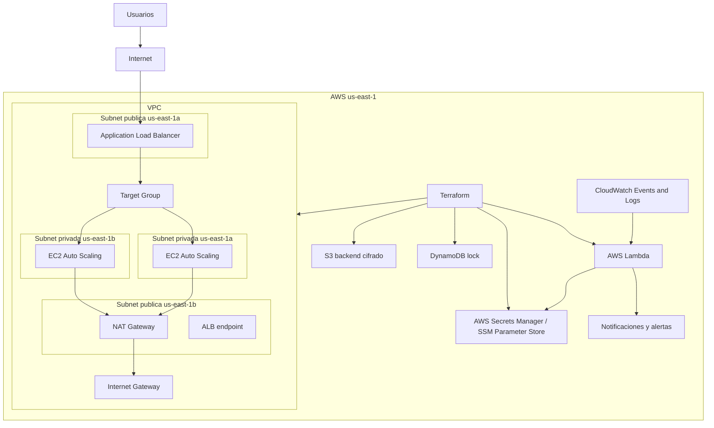

# Infraestructura cloud objetivo

La infraestructura se implementara completamente como codigo utilizando **Terraform** sobre **AWS** en la region `us-east-1`.

Se desplegara una VPC propia con subredes publicas y privadas distribuidas en dos zonas de disponibilidad. Las subredes publicas alojaran el **Application Load Balancer** y los componentes de entrada. Las subredes privadas alojaran las instancias EC2 administradas mediante **Auto Scaling Group**, sin exposicion publica directa. La salida a internet desde las subredes privadas se realizara mediante **NAT Gateway**.

El codigo Terraform se organizara en modulos reutilizables. Se creara un modulo de red para la VPC, subredes, tablas de ruteo, Internet Gateway y NAT Gateway. Tambien se implementaran modulos separados para seguridad, balanceo y computo, tomando como base los recursos existentes en el repositorio: `networking.tf`, `security_groups.tf`, `alb.tf` y `ec2.tf`.

La configuracion se parametrizara por ambiente mediante archivos `.tfvars` diferenciados:

```text
dev.tfvars
test.tfvars
prod.tfvars
```

Cada ambiente definira sus propios valores de red, cantidad de instancias, tipo de instancia, AMI, nombres de recursos, tags y parametros de escalado.

Los outputs de Terraform expondran los datos relevantes de la infraestructura y estaran documentados con descripcion. Se publicara el DNS del balanceador, el ID de la VPC, los IDs de las subredes publicas, los IDs de las subredes privadas y los endpoints necesarios para operacion e integracion.

El estado de Terraform se almacenara en un backend remoto sobre **S3**. El bucket de estado tendra cifrado habilitado, versionado y bloqueo de concurrencia mediante **DynamoDB**. No se utilizara estado local para la infraestructura objetivo.

Los secretos se gestionaran de forma segura. No se almacenaran credenciales, claves, tokens ni contrasenas en el codigo Terraform ni en archivos `.tfvars` versionados. Los valores sensibles se obtendran desde **AWS Secrets Manager** o **SSM Parameter Store**, y las variables sensibles se declararan con `sensitive = true`.

Se incorporara **AWS Lambda** como servicio serverless para automatizaciones operativas y de seguridad. La funcion Lambda procesara eventos de **CloudWatch** para generar alertas, analizar logs de seguridad y notificar eventos relevantes. Terraform creara la funcion, su rol IAM de minimos privilegios, sus permisos de ejecucion y las reglas de invocacion correspondientes.

La infraestructura resultante quedara definida, versionada y desplegable mediante Terraform, con separacion por ambientes, modulos reutilizables, estado remoto seguro, manejo protegido de secretos y automatizacion serverless integrada.

## Diagrama de componentes


