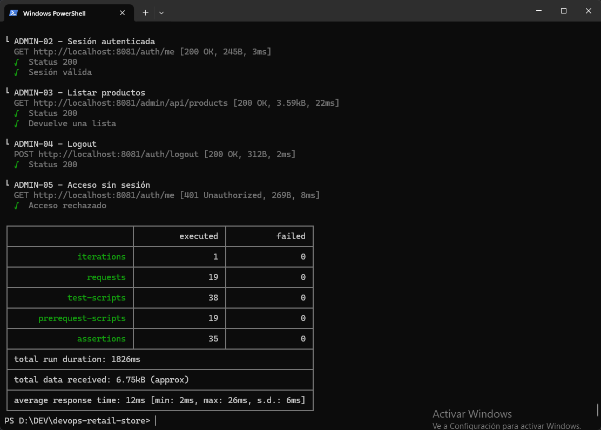

# Testing

Este documento describe la estrategia de testing aplicada al proyecto **DevOps Retail Store**.

La solución valida automáticamente el comportamiento de los principales microservicios antes de promover una versión entre los ambientes **Dev**, **Test** y **Prod**.

El detalle de resultados, hallazgos, remediaciones y evidencias se documenta en [Informe de testing](./informes/informe-testing.md).

## 1. Objetivo

El objetivo de la estrategia de testing es detectar errores funcionales y problemas de integración antes de desplegar una versión de Retail Store en el siguiente ambiente.

Las validaciones serán ejecutadas automáticamente desde el pipeline de integración continua y funcionarán como controles obligatorios para la promoción de artefactos.

Los objetivos específicos son:

* Validar que los principales microservicios estén disponibles.
* Verificar el funcionamiento de los endpoints críticos.
* Comprobar la integración entre catálogo, carrito, checkout y órdenes.
* Evitar que una versión con pruebas fallidas sea promovida.
* Generar evidencias reproducibles de las validaciones realizadas.

## 2. Alcance

La estrategia contempla pruebas funcionales y de integración sobre los siguientes microservicios:

| Microservicio | Responsabilidad                                      |
| ------------- | ---------------------------------------------------- |
| `ui`          | Interfaz principal de la aplicación.                 |
| `admin`       | Interfaz o servicio de administración.               |
| `catalog`     | Consulta y administración del catálogo de productos. |
| `carts`       | Gestión de carritos y productos seleccionados.       |
| `checkout`    | Procesamiento del flujo de checkout.                 |
| `orders`      | Registro y consulta de órdenes generadas.            |

La suite automatizada actual se ejecuta contra un stack local levantado por `Docker Compose` dentro del `runner de GitHub Actions`. Usa `local.postman_environment.json` con `baseUrl=http://localhost:8080` y `adminBaseUrl=http://localhost:8081`. 

Las ejecuciones contra ALB por ambiente quedan como mejora pendiente.

Las bases PostgreSQL y Redis no serán probadas directamente. Su funcionamiento se validará indirectamente mediante las operaciones de los microservicios que utilizan persistencia.

La primera etapa no contempla pruebas completas de interfaz gráfica ni pruebas de carga de larga duración. Estas podrán incorporarse como mejora posterior.

## 3. Herramientas seleccionadas

### 3.1. Postman

Postman se utilizará para definir las solicitudes, variables, datos y aserciones correspondientes a las pruebas funcionales y de integración.

La colección incluirá los principales flujos de Retail Store y podrá ejecutarse tanto manualmente como desde línea de comandos.

### 3.2. Newman

Newman será utilizado para ejecutar automáticamente la colección de Postman.

Su integración con el pipeline permitirá:

* Ejecutar las pruebas sin intervención manual.
* Bloquear el pipeline cuando una validación falle.
* Generar reportes en consola.
* Exportar resultados.
* Conservar los reportes como evidencia del pipeline.

## 4. Casos de prueba

La colección de Postman se organizará en grupos según el microservicio o flujo validado.

### 4.1. Disponibilidad de servicios

| ID      | Caso                               | Resultado esperado                        | Estado   |
| ------- | ---------------------------------- | ----------------------------------------- | -------- |
| DISP-01 | Consultar la aplicación principal. | La aplicación responde sin errores `5xx`. | Cubierto |
| DISP-02 | Consultar el servicio de catálogo. | El servicio responde correctamente.       | Cubierto |
| DISP-03 | Consultar el servicio de carritos. | El servicio responde correctamente.       | Cubierto |
| DISP-04 | Consultar el servicio de checkout. | El servicio responde correctamente.       | Cubierto |
| DISP-05 | Consultar el servicio de órdenes.  | El servicio responde correctamente.       | Cubierto |

### 4.2. Catálogo

| ID     | Caso                               | Resultado esperado                                               | Estado   |
| ------ | ---------------------------------- | ---------------------------------------------------------------- | -------- |
| CAT-01 | Obtener el listado de productos.   | Se obtiene una respuesta exitosa con una colección de productos. | Cubierto |
| CAT-02 | Obtener un producto existente.     | Se devuelve el producto solicitado.                              | Cubierto |
| CAT-03 | Consultar un producto inexistente. | Se devuelve una respuesta controlada, sin error interno.         | Cubierto |

### 4.3. Carrito

| ID      | Caso                             | Resultado esperado                                      | Estado   |
| ------- | -------------------------------- | ------------------------------------------------------- | -------- |
| CART-01 | Crear o inicializar un carrito.  | Se genera un carrito válido.                            | Cubierto |
| CART-02 | Agregar un producto existente.   | El producto queda asociado al carrito.                  | Cubierto |
| CART-03 | Consultar el carrito.            | Se visualizan los productos agregados.                  | Cubierto |
| CART-04 | Agregar un producto inexistente. | La aplicación rechaza la operación de forma controlada. | Cubierto |

### 4.4. Checkout y órdenes

| ID       | Caso                                                  | Resultado esperado                               | Estado   |
| -------- | ----------------------------------------------------- | ------------------------------------------------ | -------- |
| CHECK-01 | Iniciar checkout con un carrito válido.               | El proceso se inicia correctamente.              | Cubierto |
| CHECK-02 | Ejecutar checkout con un carrito inexistente o vacío. | La aplicación devuelve una respuesta controlada. | Cubierto |
| ORDER-01 | Completar el checkout.                                | Se genera una orden.                             | Cubierto |
| ORDER-02 | Consultar la orden generada.                          | La orden contiene los productos procesados.      | Cubierto |

Los endpoints, cuerpos de solicitudes y códigos HTTP esperados se encuentran versionados en la colección `tests/postman/retailstore-integration.postman_collection.json`.

## 5. Flujo de integración probado

El principal escenario de integración validará el siguiente flujo:

```text
Catalog
   ↓
Carts
   ↓
Checkout
   ↓
Orders
```

El flujo realizará los siguientes pasos:

1. Consultar el catálogo de productos.
2. Seleccionar un producto válido.
3. Crear o identificar un carrito.
4. Agregar el producto al carrito.
5. Consultar el carrito y validar su contenido.
6. Iniciar el proceso de checkout.
7. Completar la operación.
8. Obtener el identificador de la orden generada.
9. Consultar la orden.
10. Verificar que la orden contenga la información esperada.

Los identificadores generados durante la ejecución se almacenarán en variables de la colección de Postman.

Ejemplos:

```javascript
pm.collectionVariables.set("productId", productId);
pm.collectionVariables.set("cartId", cartId);
pm.collectionVariables.set("orderId", orderId);
```

Esto permitirá que las solicitudes posteriores utilicen los resultados obtenidos en los pasos anteriores.

## 6. Ejecución local

### 6.1. Requisitos

Para ejecutar las pruebas localmente será necesario contar con:

* Docker.
* Docker Compose.
* Node.js.
* Newman.
* Los microservicios de Retail Store disponibles.

### 6.2. Instalación de Newman

```bash
npm install --save-dev newman
```

### 6.3. Inicio de los servicios

Desde la raíz del repositorio:

```bash
docker compose up -d
```

Antes de ejecutar las pruebas se deberá esperar a que los servicios estén disponibles.

El estado de los contenedores podrá verificarse mediante:

```bash
docker compose ps
```

### 6.4. Ejecución de la colección

```bash
newman run tests/postman/retailstore-integration.postman_collection.json \
  --environment tests/postman/environments/local.postman_environment.json \
  --reporters cli,junit,htmlextra \
  --reporter-junit-export reports/newman/local-results.xml \
  --reporter-htmlextra-export reports/newman/local-results.html
```

El comando devolverá un código de salida distinto de cero cuando una prueba o aserción falle.

### 6.5. Finalización del entorno

```bash
docker compose down
```

## 7. Integración con GitHub Actions

Las pruebas están incorporadas como una etapa del pipeline de integración continua.

La implementación actual levanta el stack local con Docker Compose, espera los health checks de la UI y Admin, instala Newman y genera reportes JUnit y HTML.

Ejecución equivalente:

```yaml
- name: Start local services
  run: docker compose up -d --build

- name: Wait for application health checks
  run: |
    curl --fail --retry 30 --retry-all-errors --retry-delay 5 http://localhost:8080/health
    curl --fail --retry 30 --retry-all-errors --retry-delay 5 http://localhost:8081/health

- name: Install Newman
  run: npm install --global newman newman-reporter-htmlextra

- name: Run integration tests
  run: |
    mkdir -p reports/newman

    newman run tests/postman/retailstore-integration.postman_collection.json \
      --environment tests/postman/environments/local.postman_environment.json \
      --reporters cli,junit,htmlextra \
      --reporter-junit-export reports/newman/local-results.xml \
      --reporter-htmlextra-export reports/newman/local-results.html
```

El reporte generado deberá almacenarse como artefacto del workflow:

```yaml
- name: Upload Newman report
  if: always()
  uses: actions/upload-artifact@v7
  with:
    name: newman-local-test-results
    path: reports/newman/
```

El uso de `if: always()` permitirá conservar el reporte incluso cuando las pruebas fallen.

### 7.1. Ejecución por ambiente

| Rama      | Ambiente | Pruebas actuales                                      |
| --------- | -------- | ----------------------------------------------------- |
| `develop` | Dev      | Suite automatizada contra stack local en el runner.   |
| `testing` | Test     | Suite automatizada contra stack local en el runner.   |
| `main`    | Prod     | Suite automatizada contra stack local en el runner.   |

Las ejecuciones contra el ALB de cada ambiente quedan como mejora futura. Cuando se incorporen, deberán usar ambientes Postman específicos para `dev`, `test` y `prod`, evitando operaciones destructivas o datos permanentes en producción.

## 8. Quality gate de pruebas funcionales

El pipeline será bloqueado cuando ocurra alguna de las siguientes condiciones:

* Falla una prueba considerada crítica.
* Falla alguna aserción de Newman.
* Un endpoint crítico devuelve un código HTTP `5xx`.
* No es posible completar el flujo de catálogo, carrito, checkout y órdenes.
* Una solicitud crítica supera los `2000 ms`.
* Newman finaliza con un código de salida distinto de cero.

El objetivo es obtener:

```text
100 % de pruebas críticas aprobadas
```

## 9. Promoción entre ambientes

El flujo esperado será:

```text
feature/* → develop → testing → main
```

La promoción hacia `testing` requerirá:

* Build correcto.
* Controles de calidad y seguridad aprobados.
* Pruebas funcionales aprobadas.

La promoción hacia `main` requerirá:

* Suite de integración aprobada en Test.
* Pull Request aprobado por otro integrante.
* Ausencia de errores bloqueantes conocidos.

Los criterios de análisis estático y calidad de código se documentan por separado en [Calidad de código](./calidad.md).

## 10. Resultados obtenidos

La suite actual fue validada en ambiente local con Docker Compose y ejecutada con Newman. El resultado final documentado fue de **24 requests** y **50/50 assertions aprobadas**.

| Fecha            | Ambiente | Pruebas ejecutadas | Aprobadas | Fallidas | Resultado |
| ---------------- | -------- | -----------------: | --------: | -------: | --------- |
| 24/06/2026       | Local    |        50 assertions |        50 |        0 | Aprobado  |

## 11. Hallazgos significativos

Los hallazgos reales se detallan en [Informe de testing](./informes/informe-testing.md). Los principales fueron:

| ID | Hallazgo | Estado |
| -- | -------- | ------ |
| TEST-01 | Rutas de administración ejecutadas contra el puerto incorrecto. | Corregido |
| TEST-02 | Variables Postman sin resolver o leídas desde un alcance incorrecto. | Corregido |
| TEST-03 | Regresión del servicio Cart por incompatibilidad entre FastAPI, Starlette e instrumentación Prometheus. | Corregido |

## 12. Remediaciones aplicadas

Las remediaciones aplicadas y sus evidencias están consolidadas en [Informe de testing](./informes/informe-testing.md).

| Hallazgo | Remediación | Resultado |
| -------- | ----------- | --------- |
| TEST-01 | Se alinearon las URLs administrativas con `adminBaseUrl=http://localhost:8081`. | Aprobado |
| TEST-02 | Se corrigió el uso de variables de ambiente y colección en Postman. | Aprobado |
| TEST-03 | Se fijaron versiones compatibles de FastAPI, Starlette y `prometheus-fastapi-instrumentator`. | Aprobado |

## 13. Recomendaciones de mejora

Las recomendaciones iniciales son:

* Incorporar pruebas unitarias propias de cada microservicio.
* Incorporar un ambiente de datos exclusivo para testing.
* Automatizar la creación y eliminación de datos de prueba.
* Ampliar las pruebas negativas y de validación.
* Incorporar pruebas de carga con k6.
* Medir latencia percentil 95 y tasa de errores bajo carga.
* Ejecutar pruebas end-to-end de la interfaz.
* Incorporar pruebas de contrato entre microservicios.
* Mantener la colección Postman versionada junto con el código.

Estas recomendaciones podrán ajustarse según los resultados obtenidos.

## 14. Evidencias y capturas

Las evidencias se almacenan dentro del repositorio.

Estructura utilizada:

```text
docs/
├── testing.md
├── informes/
│   └── informe-testing.md
└── assets/
    └── informe-testing/
        ├── newman-dev.png
        ├── github-actions-testing.png
        └── 2026-06-24_20h25_43.png
```

Ejemplos de evidencias:

```markdown



```

## Estructura de archivos

La estructura propuesta para los recursos de testing es:

```text
tests/
└── postman/
    ├── retailstore-integration.postman_collection.json
    └── environments/
        └── local.postman_environment.json

reports/
└── newman/

docs/
├── testing.md
└── assets/
    └── informe-testing/
```

Los archivos de resultados generados por el pipeline no deberán versionarse, salvo que sean seleccionados expresamente como evidencia final del obligatorio. Los ambientes Postman para `dev`, `test` y `prod` quedan como mejora futura para pruebas contra ALB.
